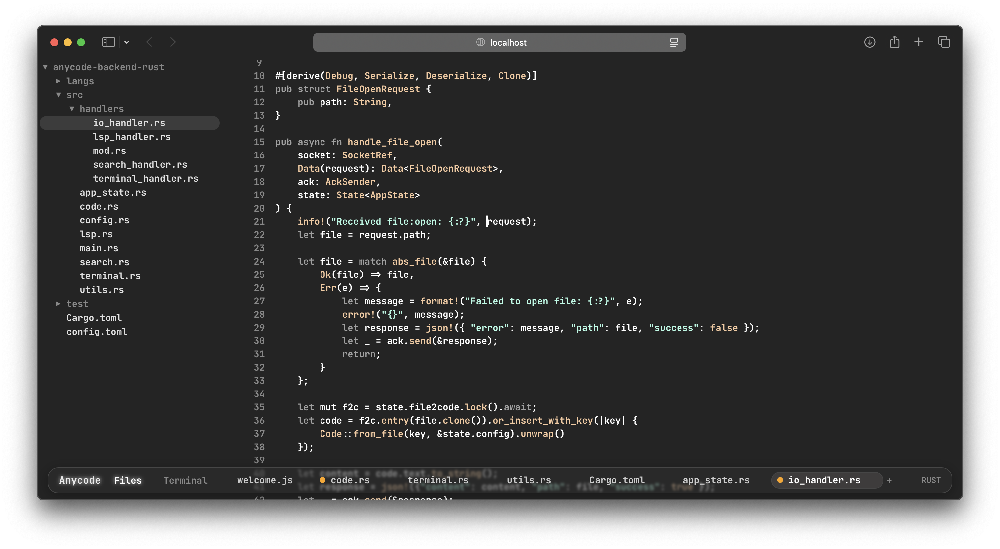

# anycode

**anycode** is a lightning-fast web-based IDE that allows you to write, edit, and manage code directly from your browser. Built for speed and performance, anycode supports a wide range of programming languages and provides an intuitive interface with powerful features for a seamless development experience.




## Features
- **Ultra-fast custom editor**: Exceptionally fast and highly optimized virtual rendering engine based on tree-sitter parser, delivering superior performance for large codebases. 
- **Multi-language support**: Work with various programming languages in a single environment.
- **Advanced code experience**: Utilizes a custom code component based on **web-tree-sitter** for efficient parsing, syntax highlighting, and real-time code analysis.
- **LSP integration**: LSP support for intelligent code completion, go-to-definition, hover information and real-time diagnostics.
- **File system integration**: WebSocket-based backend for browsing and editing files from your local filesystem.
- **Integrated terminal**: Full-featured terminal emulator with WebSocket-based communication, supporting real-time command execution and output.
- **Search functionality**: Quickly find text within files using `Win + f` (`Command + f` for MacOS).

## Architecture

The project consists of several packages:

- **`anycode/`** - Main React frontend application
- **`anycode-base/`** - Core editor library with tree-sitter support
- **`anycode-react/`** - React wrapper for the editor
- **`anycode-backend/`** - Rust backend for file system access


## Quick Start

1. **Start frontend:**
   ```bash
   pnpm install
   cd anycode
   pnpm dev
   ```

2. **Select backend - rust or node:**

3. **Start rust backend:**
   ```bash
   cd anycode-backend
   cargo run --release

4. **Open your browser** and navigate to the frontend URL

## Troubleshooting

If you encounter issues with native modules (especially on macOS ARM64), see [TROUBLESHOOTING.md](./TROUBLESHOOTING.md) for solutions.

## Contributing

We welcome contributions! Please fork the repository and submit a pull request with your changes. Make sure to follow the existing code style and include relevant tests.
